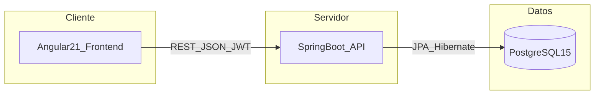

# Arquitectura — SaludLink

Documento de referencia del stack y del despliegue del proyecto SaludLink. La **sección 5** recoge las historias de usuario para el desarrollo de pantallas y flujos.

---

## 1. Resumen

SaludLink utiliza una **arquitectura de tres capas** desplegada en **contenedores Docker**. El sistema separa la presentación (frontend), la lógica de negocio y exposición de API (backend) y la persistencia de datos (base de datos), pudiendo orquestarse y escalar de forma independiente en entornos containerizados.

---

## 2. Frontend (Angular 21)

El frontend está desarrollado en **Angular 21**, combinando **HTML, CSS y JavaScript** como base tecnológica.

- **Componentes** organizados por módulo o por áreas funcionales del proyecto.
- **Servicios HTTP** para consumir la API, con **interceptor JWT** para adjuntar y gestionar el token en las peticiones autenticadas.
- **Angular Material** como biblioteca de componentes de interfaz (UI).

La aplicación se comunica con el backend mediante **llamadas REST** que **envían y reciben JSON**.

---

## 3. Backend (Java 21, Spring Boot 3)

El backend está desarrollado en **Java 21** con **Spring Boot 3**, organizado en capas siguiendo el patrón **MVC**:

**Controller → Service → Repository**

- **Maven** como gestor de dependencias.
- Empaquetado como **JAR**.
- Configuración mediante **archivo YAML**.
- La **seguridad** se implementa con **Spring Security** y **tokens JWT**.
- La **persistencia** se maneja con **Hibernate JPA** sobre **PostgreSQL 15**.

---

## 4. Comunicación entre capas

El **frontend** y el **backend** se comunican mediante **API REST**, intercambiando datos en formato **JSON**.

- En el frontend, el **interceptor JWT** asegura que las peticiones autenticadas incluyan el token de forma coherente con la política de la API.
- En el backend, **Spring Security** valida y procesa los **JWT** para proteger los recursos expuestos por los controladores.

### Diagrama de flujo (alto nivel)

---

## 5. Historias de usuario

Cada ítem incluye: **ID**, **título**, **descripción** (formato “Como… deseo… para…”) y **criterio de aceptación** (CA).

### HU01 — Registro y creación de cuenta

| Campo | Contenido |
|--------|-----------|
| **ID** | HU01 |
| **Título** | Registro y creación de cuenta |
| **Descripción** | Como nuevo usuario, deseo registrarme en la plataforma para acceder a los servicios de gestión de salud. |
| **Criterio de aceptación** | **CA01:** Dado que ingreso a la página de registro, cuando completo los datos (nombre, correo, contraseña), entonces mi cuenta es creada y accedo al dashboard. |

### HU02 — Configuración de perfil de salud

| Campo | Contenido |
|--------|-----------|
| **ID** | HU02 |
| **Título** | Configuración de perfil de salud |
| **Descripción** | Como paciente, deseo completar mi perfil médico con antecedentes y alergias para que los médicos tengan contexto sobre mi salud. |
| **Criterio de aceptación** | **CA01:** Dado que accedo a "Mi Perfil", cuando guardo mis datos clínicos básicos, entonces la información queda vinculada a mi historial para futuras consultas. |

### HU03 — Búsqueda de especialistas

| Campo | Contenido |
|--------|-----------|
| **ID** | HU03 |
| **Título** | Búsqueda de especialistas |
| **Descripción** | Como paciente, deseo filtrar médicos por especialidad y disponibilidad para encontrar la atención que requiero rápidamente. |
| **Criterio de aceptación** | **CA01:** Dado que estoy en la sección de citas, cuando aplico filtros de especialidad, entonces visualizo una lista de médicos que coinciden con mi búsqueda. |

### HU04 — Reserva de cita médica

| Campo | Contenido |
|--------|-----------|
| **ID** | HU04 |
| **Título** | Reserva de cita médica |
| **Descripción** | Como paciente, deseo reservar un cupo en un horario disponible para asegurar mi atención sin realizar llamadas telefónicas. |
| **Criterio de aceptación** | **CA01:** Dado que selecciono un médico y horario, cuando hago clic en "Confirmar Cita", entonces recibo una notificación de confirmación y la cita aparece en mi agenda. |

### HU05 — Realizar teleconsulta por video

| Campo | Contenido |
|--------|-----------|
| **ID** | HU05 |
| **Título** | Realizar teleconsulta por video |
| **Descripción** | Como paciente, deseo conectarme a una videollamada con el médico para recibir orientación profesional desde mi ubicación. |
| **Criterio de aceptación** | **CA01:** Dado que es la hora programada de la cita, cuando presiono el botón "Unirse a consulta", entonces se activa la interfaz de video de forma segura. |

### HU06 — Configurar recordatorio de medicación

| Campo | Contenido |
|--------|-----------|
| **ID** | HU06 |
| **Título** | Configurar recordatorio de medicación |
| **Descripción** | Como paciente, deseo añadir alarmas para mis medicamentos para evitar olvidos que afecten mi tratamiento. |
| **Criterio de aceptación** | **CA01:** Dado que tengo un tratamiento activo, cuando ingreso el nombre del fármaco y la frecuencia, entonces el sistema genera notificaciones automáticas en mi celular. |

### HU07 — Registrar cumplimiento de toma

| Campo | Contenido |
|--------|-----------|
| **ID** | HU07 |
| **Título** | Registrar cumplimiento de toma |
| **Descripción** | Como paciente, deseo marcar mis dosis como "tomadas" para llevar un control real de mi adherencia al tratamiento. |
| **Criterio de aceptación** | **CA01:** Dado que recibo una alerta de medicación, cuando selecciono la opción "Tomado", entonces el registro se guarda y actualiza mi gráfico de progreso. |

### HU08 — Carga de documentos médicos

| Campo | Contenido |
|--------|-----------|
| **ID** | HU08 |
| **Título** | Carga de documentos médicos |
| **Descripción** | Como paciente, deseo subir fotos o PDFs de mis exámenes físicos para evitar la pérdida de documentos en papel. |
| **Criterio de aceptación** | **CA01:** Dado que accedo al repositorio digital, cuando cargo un archivo de laboratorio, entonces el documento queda almacenado y organizado cronológicamente. |

### HU09 — Realizar testeo de salud mental

| Campo | Contenido |
|--------|-----------|
| **ID** | HU09 |
| **Título** | Realizar testeo de salud mental |
| **Descripción** | Como usuario, deseo realizar un test rápido de bienestar emocional para identificar si necesito derivación profesional inmediata. |
| **Criterio de aceptación** | **CA01:** Dado que selecciono el módulo de salud mental, cuando respondo el cuestionario de cribado, entonces recibo un resultado informativo y opciones de derivación. |

### HU10 — Validación de credenciales médicas

| Campo | Contenido |
|--------|-----------|
| **ID** | HU10 |
| **Título** | Validación de credenciales médicas |
| **Descripción** | Como médico, deseo cargar mi número de colegiatura para que la plataforma valide mi identidad y genere confianza en los pacientes. |
| **Criterio de aceptación** | **CA01:** Dado que soy un profesional nuevo, cuando cargo mis documentos de colegiatura, entonces el equipo administrativo valida mi perfil para habilitarme en el sistema. |

### HU11 — Gestión de disponibilidad médica

| Campo | Contenido |
|--------|-----------|
| **ID** | HU11 |
| **Título** | Gestión de disponibilidad médica |
| **Descripción** | Como médico, deseo configurar mis horarios de atención para que los pacientes solo agenden en mis espacios libres. |
| **Criterio de aceptación** | **CA01:** Dado que accedo a mi panel de gestión, cuando bloqueo días u horas específicas, entonces esos espacios dejan de estar disponibles en la vista del paciente. |

### HU12 — Visualización de tablero de adherencia

| Campo | Contenido |
|--------|-----------|
| **ID** | HU12 |
| **Título** | Visualización de tablero de adherencia |
| **Descripción** | Como médico, deseo ver el nivel de cumplimiento de mis pacientes para ajustar el tratamiento según datos reales de seguimiento. |
| **Criterio de aceptación** | **CA01:** Dado que consulto el perfil de un paciente asignado, cuando visualizo el tablero de analítica, entonces veo un semáforo (rojo/verde) que indica su nivel de adherencia. |

### HU13 — Exportación segura de historial clínico

| Campo | Contenido |
|--------|-----------|
| **ID** | HU13 |
| **Título** | Exportación segura de historial clínico |
| **Descripción** | Como paciente, deseo generar un archivo PDF con mi historial de tratamientos y resultados para compartirlo con médicos externos de manera segura. |
| **Criterio de aceptación** | **CA01:** Dado que ingreso a la sección de historial cronológico, cuando selecciono un rango de fechas y presiono "Exportar", entonces el sistema genera un documento protegido con un código de acceso temporal. |

### HU14 — Reprogramación asincrónica de citas

| Campo | Contenido |
|--------|-----------|
| **ID** | HU14 |
| **Título** | Reprogramación asincrónica de citas |
| **Descripción** | Como paciente con horario laboral estricto, deseo reprogramar mi cita médica desde la aplicación para evitar realizar llamadas telefónicas de cancelación. |
| **Criterio de aceptación** | **CA01:** Dado que tengo una cita próxima confirmada, cuando selecciono la opción "Reprogramar" y elijo un nuevo horario disponible, entonces la cita anterior se libera automáticamente y recibo la nueva confirmación. |

### HU15 — Gestión de perfiles dependientes

| Campo | Contenido |
|--------|-----------|
| **ID** | HU15 |
| **Título** | Gestión de perfiles dependientes |
| **Descripción** | Como madre o cuidador, deseo crear perfiles adicionales en mi cuenta para gestionar las citas y tratamientos de mis hijos o familiares a cargo. |
| **Criterio de aceptación** | **CA01:** Dado que accedo a la configuración de cuenta, cuando selecciono "Añadir dependiente" y completo sus datos, entonces puedo alternar entre perfiles para gestionar sus agendas de salud de forma independiente. |

### HU16 — Pago de consultas en línea

| Campo | Contenido |
|--------|-----------|
| **ID** | HU16 |
| **Título** | Pago de consultas en línea |
| **Descripción** | Como paciente, deseo realizar el pago de mi consulta de forma digital para confirmar mi reserva y agilizar el proceso administrativo. |
| **Criterio de aceptación** | **CA01:** Dado que selecciono una cita de pago, cuando ingreso los datos de mi tarjeta o billetera digital, entonces el sistema procesa el pago y emite un comprobante electrónico. |

### HU17 — Calificación y reseñas de atención

| Campo | Contenido |
|--------|-----------|
| **ID** | HU17 |
| **Título** | Calificación y reseñas de atención |
| **Descripción** | Como paciente, deseo calificar la atención recibida y dejar un comentario para ayudar a otros usuarios a elegir profesionales confiables. |
| **Criterio de aceptación** | **CA01:** Dado que una consulta ha finalizado, cuando accedo a la sección de valoraciones, entonces puedo asignar estrellas y redactar una reseña que será pública en el perfil del médico. |

### HU18 — Botón de redirección de emergencia

| Campo | Contenido |
|--------|-----------|
| **ID** | HU18 |
| **Título** | Botón de redirección de emergencia |
| **Descripción** | Como usuario en situación crítica, deseo un acceso rápido a números de emergencia para recibir ayuda inmediata fuera de la plataforma. |
| **Criterio de aceptación** | **CA01:** Dado que me encuentro en el dashboard principal, cuando presiono el botón de "Emergencia SOS", entonces el sistema despliega los números de contacto locales (SAMU/Bomberos). |

### HU19 — Personalización de alertas de salud

| Campo | Contenido |
|--------|-----------|
| **ID** | HU19 |
| **Título** | Personalización de alertas de salud |
| **Descripción** | Como paciente, deseo elegir los sonidos y la frecuencia de mis recordatorios para que no interfieran con mis momentos de descanso. |
| **Criterio de aceptación** | **CA01:** Dado que ingreso a la configuración de notificaciones, cuando ajusto el volumen o el tipo de alerta, entonces el sistema aplica los cambios para los próximos recordatorios. |

### HU20 — Chat de seguimiento post-consulta

| Campo | Contenido |
|--------|-----------|
| **ID** | HU20 |
| **Título** | Chat de seguimiento post-consulta |
| **Descripción** | Como paciente, deseo enviar mensajes de texto cortos al médico tras la consulta para resolver dudas puntuales sobre las indicaciones recibidas. |
| **Criterio de aceptación** | **CA01:** Dado que tengo una consulta reciente, cuando escribo en el chat habilitado, entonces el médico recibe la consulta y puede responder de forma asincrónica. |

### HU21 — Registro de institución de salud

| Campo | Contenido |
|--------|-----------|
| **ID** | HU21 |
| **Título** | Registro de institución de salud |
| **Descripción** | Como administrador de una clínica u hospital, deseo registrar mi institución en la plataforma SaludLink para gestionar a mis médicos y pacientes desde un panel centralizado. |
| **Criterio de aceptación** | **CA01:** Dado que soy un administrador nuevo, cuando completo los datos de mi institución (nombre, RUC, dirección, tipo de establecimiento), entonces mi institución queda registrada y accedo al panel administrativo institucional. |

### HU22 — Gestión de médicos afiliados a la institución

| Campo | Contenido |
|--------|-----------|
| **ID** | HU22 |
| **Título** | Gestión de médicos afiliados a la institución |
| **Descripción** | Como administrador del hospital o clínica, deseo agregar, editar y desactivar los perfiles de los médicos de mi institución para controlar su disponibilidad y credenciales desde un solo lugar. |
| **Criterio de aceptación** | **CA01:** Dado que accedo al panel de gestión institucional, cuando selecciono "Agregar médico" y completo sus datos profesionales, entonces el médico queda vinculado a mi institución y su perfil aparece disponible para los pacientes en la plataforma. |

### HU23 — Reportes de asistencia y no-shows institucional

| Campo | Contenido |
|--------|-----------|
| **ID** | HU23 |
| **Título** | Reportes de asistencia y no-shows institucional |
| **Descripción** | Como administrador de un hospital o clínica, deseo visualizar reportes de tasas de asistencia y no-shows de mi institución por periodo para tomar decisiones operativas basadas en datos reales. |
| **Criterio de aceptación** | **CA01:** Dado que accedo al módulo de reportes institucionales, cuando selecciono un rango de fechas y presiono "Generar reporte", entonces el sistema muestra métricas de asistencia, cancelaciones y no-shows con gráficos comparativos por médico y especialidad. |

### HU24 — Panel administrativo del hospital

| Campo | Contenido |
|--------|-----------|
| **ID** | HU24 |
| **Título** | Panel administrativo del hospital |
| **Descripción** | Como administrador de una clínica u hospital afiliado, deseo tener un dashboard centralizado con métricas clave de mi institución para monitorear el desempeño operativo y la satisfacción de mis pacientes en tiempo real. |
| **Criterio de aceptación** | **CA01:** Dado que inicio sesión como administrador institucional, cuando accedo al dashboard principal, entonces visualizo un resumen con: total de citas del día, tasa de ocupación médica, alertas de no-shows y nivel promedio de adherencia de los pacientes atendidos. |

---

*Documento de arquitectura e historias de usuario para alineación del equipo con el stack y los flujos de SaludLink.*
